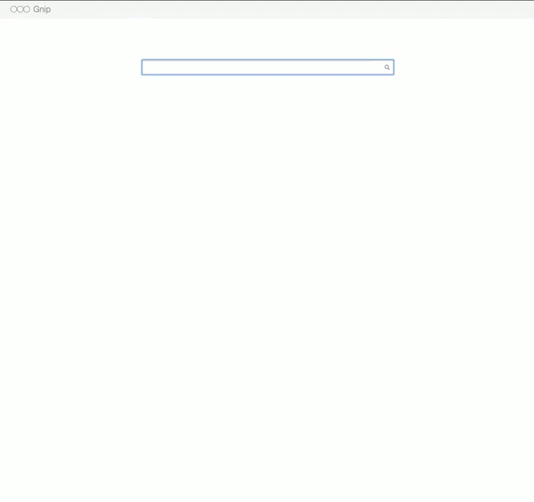

# Overview

Gnip has built this internal app on top of its Search API product for demo purposes,
in order to visually highlight the product's functionality and the type of interface
that Gnip customers could build into their products to leverage the Search API for
internal use or exposure to their clients. This is not an official, supported application.
Please do not contact support with any requests regarding this project.

# Features

* Single, one-page Search UI.
* CoffeeScript and SASS source map debugging support.

# Requirements

1. [Ruby 2.0.x](http://www.ruby-lang.org).
2. [Ruby on Rails 4.0.x](http://rubyonrails.org).
3. All major browsers + Internet Explorer 9+. Don't even try IE8, seriously, it's not pretty.
4. You may need Python on your `PATH` to install some dependencies

# Setup

Open a terminal window and execute the following commands:

Current Version (stable)

    git clone git://github.com/gnip/search-api-rails-demo.git
    cd search-api-rails-demo
    git checkout v1.0.0

Master Version (unstable)

    git clone git://github.com/gnip/search-api-rails-demo.git
    cd search-api-rails-demo

Ensure the following environment variables are set:

* GNIP_ACCOUNT = Your Gnip account.
* GNIP_STREAM_NAME = Your Gnip stream name.
* GNIP_USERNAME = Your Gnip username.
* GNIP_PASSWORD = Your Gnip password.
* MAPBOX_API_KEY = Apply your API key within [main.coffee](app/assets/javascripts/main.coffee).
  If you need a key, you can get one at [mapbox.com](http://www.mapbox.com).

# Usage

To run, execute `bundle install` and then `rails s`.

# Testing

To test, do the following:

0. Tests: `rake spec`
0. Features: `rake cucumber`
0. Jasmine Tests: `rake spec:javascript`

NOTE: Guard will automatically run Cucumber, RSpec, and CoffeeScript (sorry, no auto-jasmine yet).

# Versioning

Read [Semantic Versioning](http://semver.org) for details. Briefly, it means:

* Patch (x.y.Z) - Incremented for small, backwards compatible bug fixes.
* Minor (x.Y.z) - Incremented for new, backwards compatible public API enhancements and/or bug fixes.
* Major (X.y.z) - Incremented for any backwards incompatible public API changes.

# Contributions

Read CONTRIBUTING for details.

# Credits

* [Eric Wendelin](https://github.com/eriwen)
* [Brooke Kuhlmann](https://github.com/bkuhlmann)
* [Caleb Doxsey](https://github.com/calebdoxsey)

# License

Copyright (c) 2013 [Gnip](http://gnip.com).
Read the LICENSE for details.

# History

Read the CHANGELOG for details.
